\newpage

# Introduction

This report covers the full pipeline built to predict household appliance
energy consumption (`Appliances`, measured in Wh) using the UCI Appliance
Energy Prediction dataset. It contains environmental, time-based, and
energy-related sensor readings taken every 10 minutes from a low-energy
house in Belgium, from January to May 2016.

The goal was to preprocess and analyze the dataset, engineer useful
features, and design architectural models that can forecast `Appliances`
consumption, using a proper, leakage-free evaluation setup.

The work is spread across five notebooks and a shared `src/` library:

1. **EDA** (`01_EDA.ipynb`): data quality checks, target distribution,
   seasonality, correlation, and scaling analysis
2. **Feature Engineering** (`02_Feature_Engineering.ipynb`): cyclical,
   rolling, lag, and interaction features, plus a four-stage feature
   selection process
3. **Baseline Models** (`03_Baseline_Models.ipynb`): Linear Regression and
   Random Forest
4. **Deep Learning Models** (`04_Deep_Learning.ipynb`): LSTM, GRU, CNN-LSTM,
   TCN, and CNN-LSTM with Attention
5. **Optimization and Evaluation** (`05_Optimization_Evaluation.ipynb`):
   hyperparameter tuning, ablation studies, comparisons against classical and
   tree-based models, and a hybrid model built from two of the above

Before going further, it would be better to be upfront about the headline result because
it isn't the one someone would expect from a brief that's framed entirely around
deep learning; In this process, Linear Regression beats every deep learning architecture that was
trained, and the strongest model overall turned out to be a hybrid of
Linear Regression and a GRU. Section 8 walks through the tests ran to
check whether that gap is something which could still fix, or whether it's a
genuine limit set by the data itself. Section 10 explains why that
finding, and the way it was investigated, which is actually the most useful result
this assessment produced.

\newpage

# Data Insights

## Dataset Overview

| Property | Value |
|---|---|
| Rows | 19,735 |
| Columns (raw) | 29 |
| Date range | 2016-01-11 17:00 to 2016-05-27 18:00 |
| Duration | 137 days |
| Interval | 10 minutes |
| Missing values | None |
| Duplicate rows | 0 |

The raw dataset doesn't quite match the assessment's description. It has 9
indoor temperature and humidity sensor pairs (`T1` to `T9`, `RH_1` to
`RH_9`) instead of 6, plus a `Tdewpoint` column, and it's missing the
`NSM`, `WeekStatus`, and `Day_of_week` columns the brief mentions. Those three were
engineered from the timestamp instead (see Feature Engineering
below). The dataset also includes two random noise columns, `rv1` and
`rv2`, which the original dataset authors added on purpose as a control to
test whether feature selection would correctly discard them. It was confirmed that
they're identical to each other and barely correlated with the target
(correlation of -0.011), so both were dropped right away.

## Target Variable

`Appliances` is heavily right-skewed:

| Statistic | Value |
|---|---|
| Mean | 97.69 Wh |
| Std | 102.52 Wh |
| Median | 60.0 Wh |
| Min / Max | 10 / 1080 Wh |
| Skewness | 3.39 |
| Kurtosis | 13.67 |

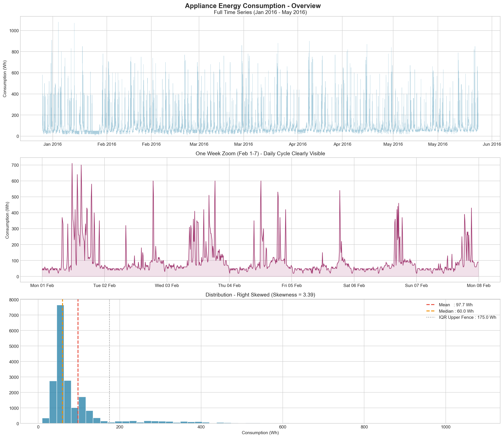{width=95%}

This skew is the reason Huber loss was used instead of plain MSE for every
deep learning model (more on this in Preprocessing). MSE would let the loss
be dominated by rare high-consumption spikes rather than typical behavior.

## Seasonality (STL Decomposition)

Running an STL decomposition with a period of 144 steps (24 hours) shows a
strong daily seasonal cycle, with the seasonal component ranging from
-285.1 to +733.9 Wh against a much smaller trend component (38.5 to 115.0
Wh). This is what justified using 144 steps as one of the candidate
sequence windows tested later for the deep learning models.

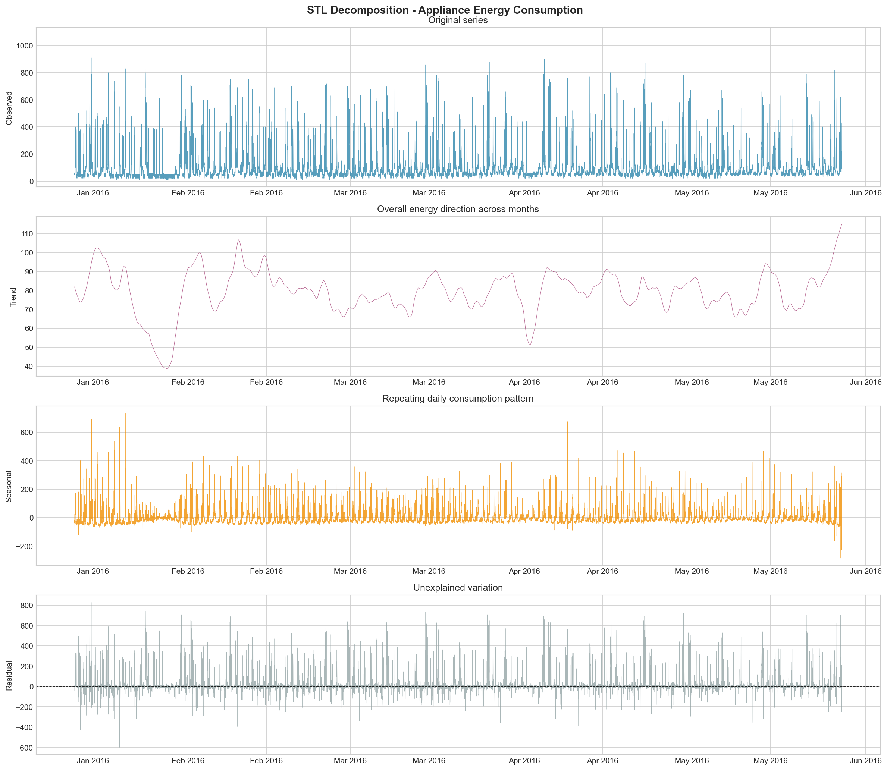{width=95%}

## Temporal Patterns

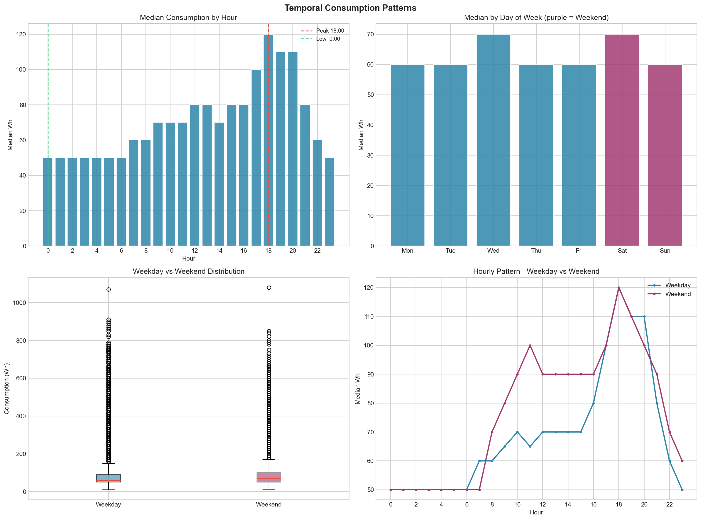{width=95%}

A few things stood out here:

- Peak hour is 18:00 (120 Wh average), and the lowest point is 00:00 (50 Wh
  average)
- Weekday average is 96.6 Wh, weekend average is 100.6 Wh, so there's a
  modest but real difference between the two
- Weekends show a consumption bump between 11:00 and 12:00 that doesn't
  show up on weekdays at all. That pattern doesn't exist in any raw column
  on its own, so a `weekend_lunch_peak` feature was built specifically to
  capture it

## Correlation Analysis

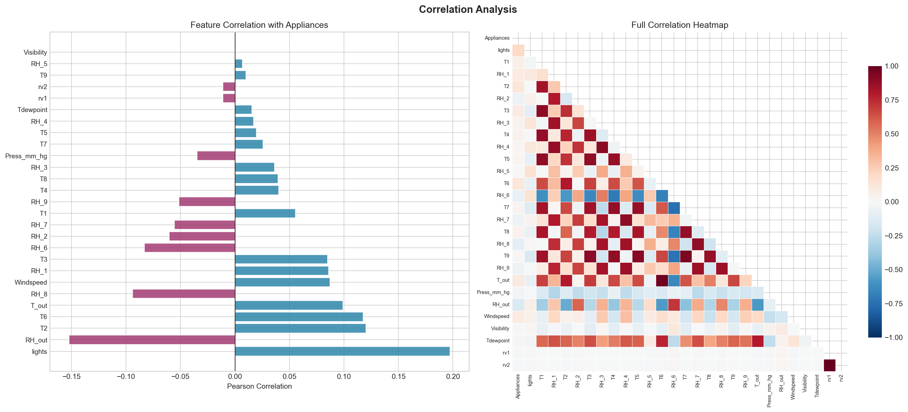{width=95%}

No single raw sensor correlates strongly with `Appliances` by itself. The
strongest ones are `lights` (0.197), `RH_out` (-0.152), `T2` (0.120), and
`T6` (0.118), and none of those are particularly strong. This turned out to
be an early hint of something bigger, that would be discussed in Model Optimization:
`Appliances` is much better predicted by its own recent history than by any
environmental sensor.

## Feature Distributions

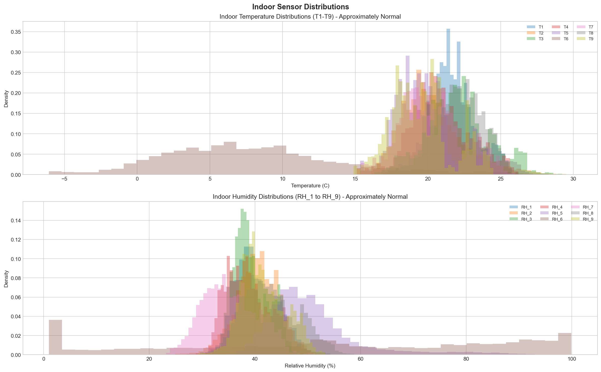{width=95%}

Most of the indoor temperature and humidity sensors (`T1` to `T5`, `T7` to
`T9`, `RH_1` to `RH_9`) look roughly normal, which is why the pipeline went with
StandardScaler for the input features. `T6` is the exception. It looks flat
and uniform, sitting between -5°C and 12°C rather than following a normal
curve. Later correlation analysis (in Feature Engineering, Stage 2)
confirms `T6` is basically a duplicate of the outdoor temperature `T_out`
(correlation of 0.975), which fits with it being an outdoor-adjacent
sensor rather than a genuine indoor reading.

## Outlier Detection

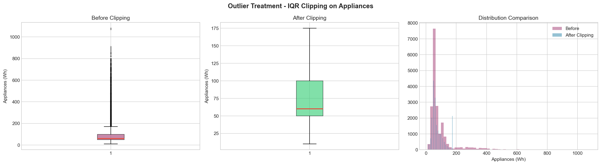{width=95%}

Using the standard IQR method (Q1=50, Q3=100, IQR=50), 2,138 rows (10.83%
of the data) go above the upper fence of 175 Wh. It was decided to clip these
rather than remove them. Removing rows from a time series leaves gaps in
the index, and any rolling or lag feature computed afterward would either
produce NaNs or accidentally splice together timestamps that aren't
actually adjacent. Clipping keeps every row in place while capping the
extreme values.

## ACF / PACF Analysis

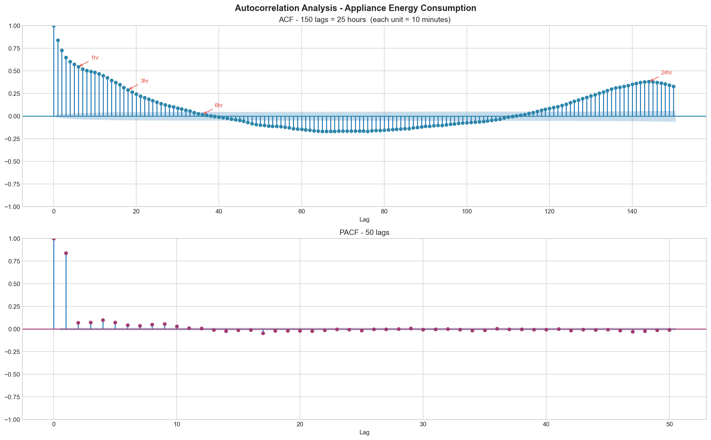{width=95%}

| Lag | Duration | ACF |
|---|---|---|
| 1 | 10 min | 0.8405 |
| 3 | 30 min | 0.6482 |
| 6 | 1 hr | 0.5467 |
| 18 | 3 hr | 0.2913 |
| 36 | 6 hr | 0.0193 |
| 144 | 24 hr | 0.3818 |

The PACF plot is significant almost only at lag 1 and 2, which is a
textbook AR(1) signature. The ACF plot forms a U-shape, dropping toward
lag 36 and then climbing back up at lag 144, confirming the 24-hour cycle.
This analysis is what shaped the final lag set used in Feature Engineering
(1, 3, 6, 18, 36, 144) and the three candidate sequence windows tested for
the deep learning models (24, 72, 144 steps).

## EDA Summary Table

| Finding | Decision |
|---|---|
| No missing values, no duplicates | No imputation or deduplication needed |
| `rv1`/`rv2` identical, near-zero target correlation | Dropped |
| Extra sensors (`T7` to `T9`, `RH_7` to `RH_9`, `Tdewpoint`) present | Kept, since they add signal |
| `NSM`/`WeekStatus`/`Day_of_week` absent | Engineered from the timestamp |
| Target skewness 3.39 | Huber loss as the main loss, MSE tested for comparison |
| 2,138 outlier rows (10.83%) | Clipped at the IQR upper fence, rows not removed |
| Sensors mostly normal, `T6` uniform and outdoor-adjacent | StandardScaler for all input features |
| Target needs a bounded range | MinMaxScaler for `Appliances` only, fit after clipping |
| Strong daily seasonality (STL) | 144-step window kept as one sequence-length option |
| PACF significant only at lag 1-2 | Short lags carry most of the individual signal |
| ACF and PACF together | Lags 1, 3, 6, 18, 36, 144 selected |
| Weekend 11:00-12:00 peak absent on weekdays | Added a `weekend_lunch_peak` interaction feature |

\newpage

# Preprocessing

All of the preprocessing logic lives in `src/data_preprocessing.py` and gets
imported into each notebook rather than rewritten each time.

## Missing Values and Duplicates

There weren't any. It was checked programmatically with
`check_data_quality()` rather than just assuming it, so no imputation or
deduplication step was needed.

## Noise Column Removal

`rv1` and `rv2` are identical to each other and barely correlated with the
target (-0.011), so `drop_noise_columns()` removes both. These are
intentional random controls the original dataset authors added to test
whether a feature selection pipeline would correctly throw them out. The
four-stage selection process described later confirms independently that
they carry no useful signal.

## Outlier Treatment

`clip_outliers_iqr()` clips `Appliances` at the IQR upper fence (175 Wh,
using the standard 1.5x multiplier) instead of removing rows. This choice was made,
because deleting rows breaks the temporal continuity that every
rolling and lag feature depends on. Clipping caps the 2,138 extreme rows
(10.83% of the data) while keeping the series intact.

## Scaling

Two different scalers were used for two different reasons:

Input features use `StandardScaler`. Most sensor readings are roughly
normally distributed, as shown in the EDA, and StandardScaler centers each
feature at 0 with unit variance independently of the others.

The target uses `MinMaxScaler`, applied after outlier clipping so it ends
up bounded in a clean 0 to 1 range. That matches the natural output range
of the models and avoids any scale mismatch when computing the loss.

Both scalers are fit only on the training set and then applied to the test
set without being refit. Fitting on the full dataset, test set included,
would leak information from the test set into training. It's a common
mistake and was checked carefully.

## Data Splitting

The standard split of 80/20 was used based on time, not a random split. The first 80% of
the chronologically sorted data is training data, and the last 20% is test
data, with no shuffling involved. A random split would let future rows leak
into training, both directly and through any lag or rolling feature that
looks at neighboring rows, which would quietly inflate every metric
reported. A further 15% from the end of the training set was carved out as
a validation split, still in temporal order, used for early stopping and
comparing hyperparameters. The test set stays fully untouched until the
final evaluation.

\newpage

# Feature Engineering

This is implemented in `src/feature_engineering.py` and applied in
`notebooks/02_Feature_Engineering.ipynb`.

## Time-Based Features

The following features were engineered from the timestamp, since the raw dataset doesn't have
them. They are `hour` (0-23), `day_of_week` (0 for Monday through 6 for
Sunday), `month`, `week_status` (Weekday or Weekend), and `NSM` (seconds
since midnight)

Cyclical encoding was added for `hour` and `day_of_week`, turning each
into a sin/cos pair. A plain integer encoding makes hour 23 and hour 0 look
maximally far apart, when they're actually adjacent. Placing them on a
circle instead fixes that and matches the daily cycle that STL and ACF
both confirmed.

## Rolling Averages and Moving Windows

1-hour, 3-hour, and 6-hour rolling mean and standard deviation
of `Appliances` (6, 18, and 36 steps at 10-minute resolution) were computed. Every
rolling window is shifted by one step before it's applied, so a feature at
row t never includes the value being predicted at row t itself. Without
that shift, a rolling mean over rows t-5 through t would quietly leak the
answer into the input.

## Lagged Features

Lags of `Appliances` at 1, 3, 6, 18, 36, and 144 steps were added and chosen
directly from the ACF/PACF analysis. Lags 1 to 3 cover the AR(1) structure
PACF showed, and lag 144 covers the daily cycle confirmed by ACF.

## Interaction Features

- `heat_index_proxy`: `T_out` multiplied by `RH_out`
- `indoor_outdoor_delta`: the average of the indoor temperature sensors
  minus `T_out`
- `weekend_lunch_peak`: set to 1 if `day_of_week` is Saturday or Sunday and
  `hour` is 11 or 12. This captures the weekend-only midday peak from the
  EDA that neither `week_status` nor `hour` alone can represent.

## Domain-Specific Features

A holiday or special event calendar wasn't added, since this is a single house
in Belgium over 137 days, and the dataset doesn't include a holiday
indicator, so it would've had to source one externally. It was decided against
fabricating a calendar without a verified source, since getting it wrong
would introduce incorrect labels rather than useful signal. These are listed
as future work in the Conclusion rather than skip it silently.

## Handling Engineering-Induced Missing Values

Lag-144 needs 144 prior rows to exist, so the first 144 rows of the
dataset can't have a complete feature set. These rows (about
0.73% of the data) were dropped instead of imputing them, since imputing a lag feature
would mean inventing history that never happened.

## Feature Selection: A Four-Stage Process

Instead of relying on one method, the features were run through four
progressively stricter stages, each catching a different kind of
redundancy or noise:

| Stage | Method | Features In -> Out |
|---|---|---|
| 1 | Zero-signal removal (`rv1`, `rv2`) | 50 -> 48 |
| 2 | Pairwise correlation redundancy (threshold 0.95) | 48 -> 46 |
| 3 | Random Forest impurity importance (ranking only) | 46 -> 46 |
| 4 | Permutation importance on held-out validation data | 46 -> 32 |

Stage 2 dropped exactly two redundant pairs: `T_out`/`T6` (correlation
0.975, confirming `T6`'s outdoor-adjacent nature from the EDA) and
`NSM`/`hour` (correlation 0.999, two encodings of essentially the same
thing).

Stage 3, Random Forest importance, ranked `Appliances_lag1` far above
everything else, at roughly 0.72 relative importance, which lines up with
the AR(1) signature from PACF. The rolling statistics formed a clear
second tier below it. `Press_mm_hg` ranked surprisingly high, in the top
8, which was flagged as suspicious rather than trusting outright.

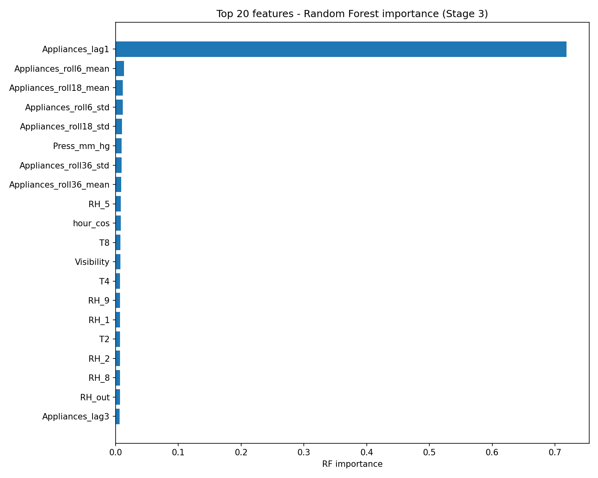{width=90%}

Stage 4, permutation importance, exists specifically because impurity-based
importance is known to favor high-cardinality, continuous features. It
confirmed `Appliances_lag1` (about 0.55) and `Appliances_roll6_mean`
(about 0.10) as the two real drivers, with `hour_cos` a distant but genuine
third (about 0.03). It also settled the `Press_mm_hg` question, that once
measured by actual held-out performance rather than tree impurity, it fell
out of the top 20 entirely, confirming its Stage 3 ranking was an
artifact rather than real signal.

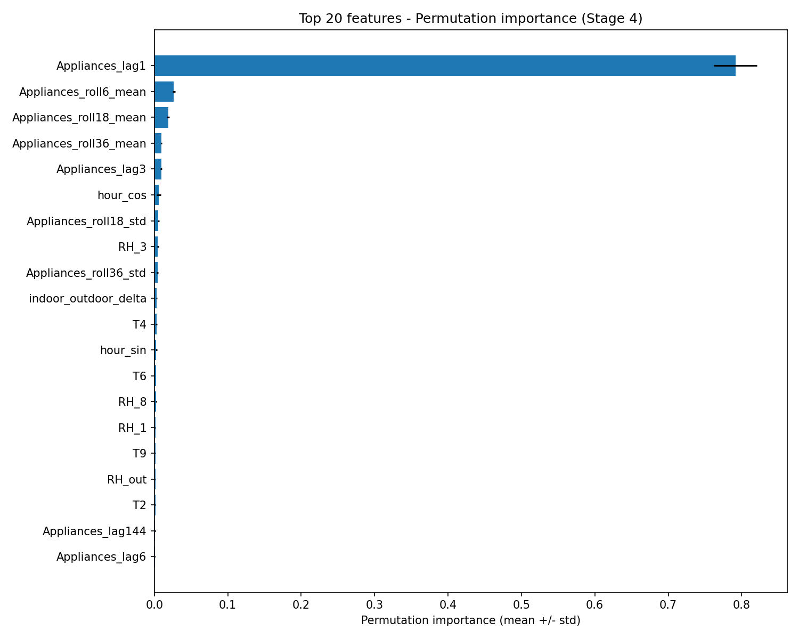{width=90%}

The final set of 32 features is dominated by `Appliances` lag and rolling
features (11 of the 32), humidity sensors (`RH_1` through `RH_9` plus
`RH_out`, 8 features total), the two interaction terms, cyclical and
temporal features, and a handful of raw sensors (`T4`, `T8`, `Tdewpoint`,
`Press_mm_hg`, `Windspeed`, `lights`). The full list is saved in
`data/processed/selected_features.txt`.

\newpage

# Model Design

## Baselines

Linear Regression has no hyperparameters to tune, so it doubles as a
sanity check that the whole pipeline works end to end before moving on to
anything more complex. Random Forest (`n_estimators=200`,
`random_state=42`) is a non-linear baseline, using the same configuration
already used for feature importance ranking so the numbers stay
comparable.

## Deep Learning Architectures

All five deep learning models are built in PyTorch (`src/model.py`) and
share the same building blocks through a single `get_model()` function.

Each takes a sequence of the 32 selected features over some window of past
time steps, with the window length chosen empirically (see Model
Optimization).

For regularization, a custom function `SpatialDropout1D` module was built (using
`nn.Dropout2d` over the feature-channel dimension) and applied it to the
input sequence. Standard dropout zeroes individual values at each time
step independently, which lets a recurrent layer patch over a dropped
value using neighboring steps and weakens the regularization. Spatial
dropout instead drops whole feature channels consistently across the
entire sequence.

For the loss function, Huber loss was used by default, since the target's
skewness of 3.39 means MSE would be dominated by rare high-consumption
spikes. Huber behaves like MSE for small errors and like MAE for large
ones. An explicit MSE comparison was also run which is covered in Model Optimization.

For the optimizer, Adam with cosine annealing learning rate
scheduling was used, which decays smoothly rather than dropping abruptly, lowering
the chance of the optimizer getting stuck right after a sudden learning
rate cut.

For training controls, early stopping was used based on validation loss,
restoring the best-performing weights afterward, and fixed random seeds
across `random`, `numpy`, and `torch` (including the training data
loader's shuffle order) so runs are reproducible.

| Architecture | Structure | Hidden size | Notes |
|---|---|---|---|
| LSTM | Spatial dropout, then a single LSTM layer, then a linear layer on the last step | 64 | The baseline recurrent model |
| GRU | Same as LSTM but with a GRU cell | 64 | Fewer parameters than LSTM at similar capacity |
| CNN-LSTM | A Conv1D layer (32 channels, kernel size 3), then ReLU, spatial dropout, then an LSTM, then a linear layer | 64 | The convolution picks up local patterns before the LSTM handles longer-range dependencies |
| TCN | Three stacked dilated causal blocks (dilations 1, 2, 4), each with two convolutions, a "chomp" step to trim padding, ReLU, dropout, and a residual connection | 32 channels per layer | Gets a wide receptive field without needing a very deep stack |
| CNN-LSTM with Attention | Conv1D, spatial dropout, LSTM, then additive attention over every LSTM output step, producing a context vector fed into a linear layer | 64 | The main interpretability-focused model. Its attention weights are visualized in the Results section |

The attention mechanism works by giving each time step a learned score,
normalizing those scores with softmax so they sum to 1, and using them to
build a weighted context vector. This lets both the model and me see which
positions in the window it actually relies on, rather than only using the
LSTM's final hidden state the way CNN-LSTM does.

## The Hybrid Model Found During Optimization

There's a sixth configuration that wasn't part of the original five
architectures but ended up being the best performer overall. Linear
Regression, followed by a GRU trained on Linear Regression's residuals,
with both predictions combined at inference time. Its design and
results are fully explained in Model Optimization and Results, since it came out of the
optimization phase rather than the initial design.

\newpage

# Results

## Baseline Comparison

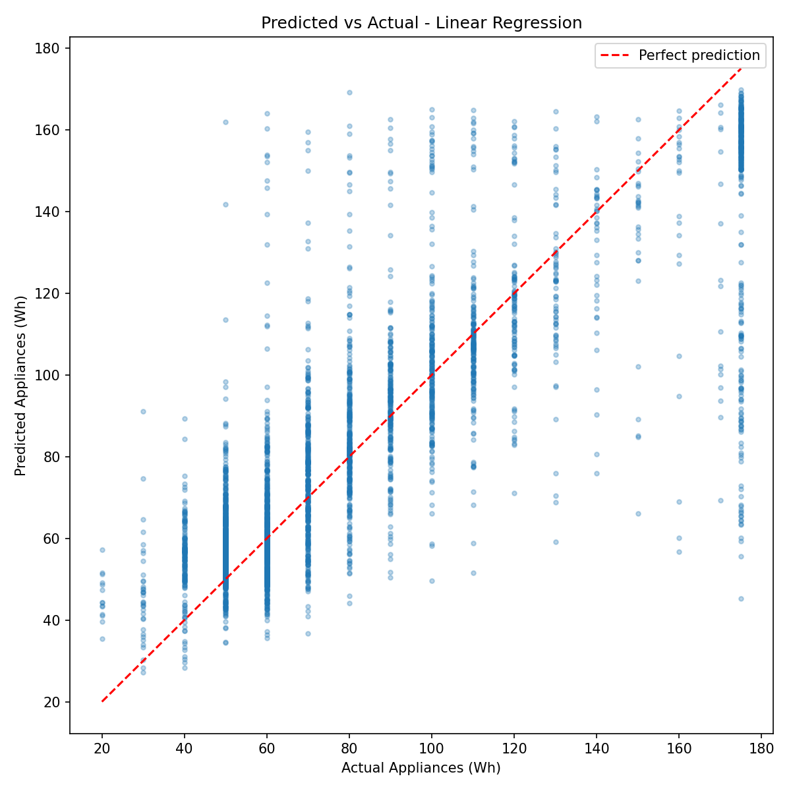{width=90%}

| Model | MAE (Wh) | RMSE (Wh) | MAPE (%) | R2 |
|---|---|---|---|---|
| Linear Regression | 13.51 | 21.30 | 17.61 | 0.696 |
| Random Forest | 16.54 | 23.18 | 21.93 | 0.640 |

Linear Regression wins outright here. The guess is that Random Forest's
default tree depth overfits on the 31 secondary features surrounding the
one dominant predictor, `Appliances_lag1`.

## Deep Learning Comparison

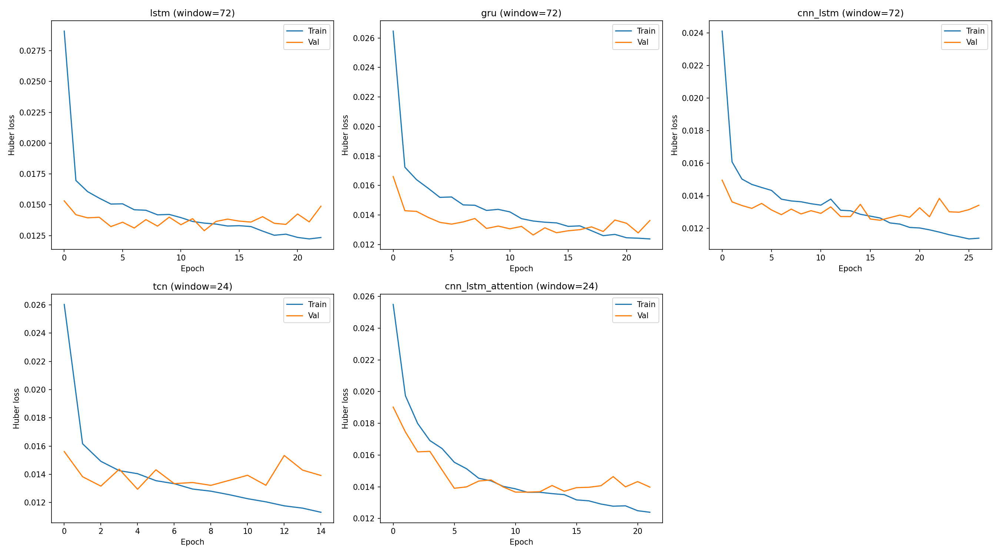{width=95%}

| Model | MAE (Wh) | RMSE (Wh) | MAPE (%) | R2 | Window |
|---|---|---|---|---|---|
| GRU | 17.40 | 25.77 | 22.00 | 0.551 | 24 |
| CNN-LSTM | 18.35 | 25.95 | 24.49 | 0.544 | 24 |
| LSTM | 17.45 | 26.10 | 22.27 | 0.539 | 24 |
| CNN-LSTM with Attention | 18.07 | 26.17 | 23.56 | 0.537 | 24 |
| TCN | 19.55 | 27.33 | 26.19 | 0.495 | 24 |

All five architectures independently settled on a 24-step (4-hour) window
as their best choice during the sweep phase, out of candidates 24, 72, and
144 steps. That agreement across all five models is a useful confirmation
on its own. The learning curves show healthy convergence for every
architecture, where training loss decreases steadily, validation loss
flattens out, and early stopping triggers in before anything diverges. There's
no overfitting problem here. The gap between train and validation loss
stays small the whole time, which tells these models are underfitting
the signal that Linear Regression already picks up directly, rather than
overfitting or training badly.

GRU is the strongest deep learning model of the five, but every single one
of them falls short of both baselines.

## Residual Diagnostics

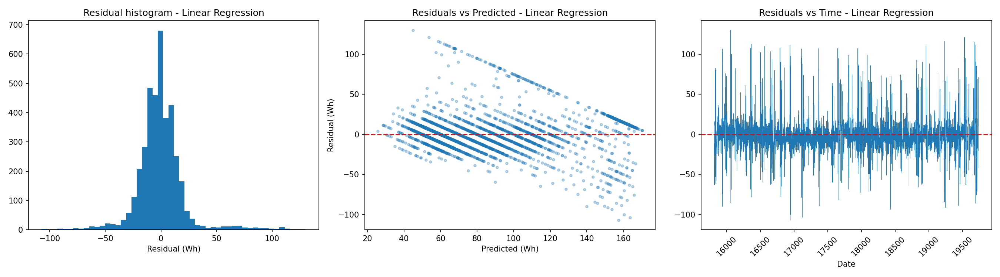{width=95%}

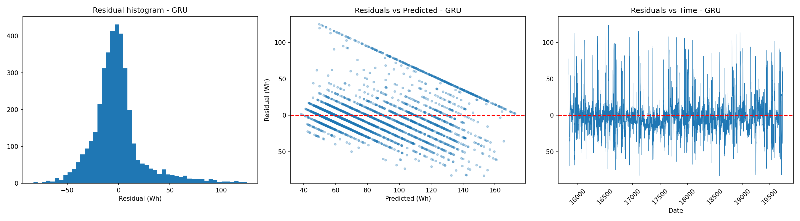{width=95%}

Both models show the same kind of error pattern. Residuals track well in
the 50 to 120 Wh range where most of the data sits, overpredict at the low
end (roughly 20 to 40 Wh), and underpredict at the high end (150 Wh and
above), which is a direct consequence of the target's skew. GRU's residual
spread is visibly wider than Linear Regression's, matching its higher
RMSE, but the shape of the error is the same for both. The deep model
isn't failing differently, it's failing the same way, just by more.

## Attention Weight Interpretation

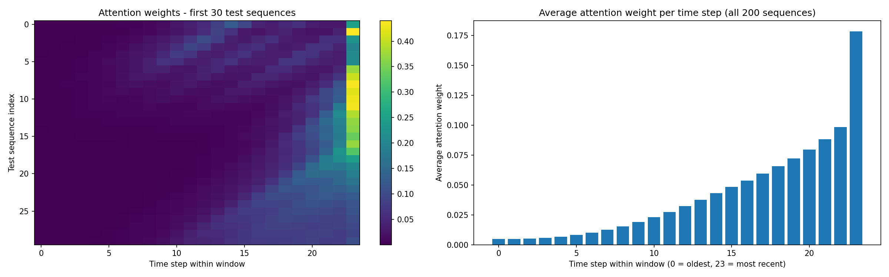{width=90%}

Attention concentrates heavily on the single most recent time step. The
average weight sits at 0.165 for the step right before the prediction,
compared to roughly 0.01 to 0.03 for the oldest steps in the window, and
the most recent step is the single most-attended position in 132 of 200
sampled test sequences. This lines up with the AR(1)-like structure behind
`Appliances_lag1`'s dominance throughout this project, and it matches the
finding that the shortest candidate window (24 steps) beat the longer
ones. The model has effectively learned on its own that recent history
matters far more than distant history, which is exactly what the ACF/PACF
analysis predicted back in the Data Insights section.

## Final Ranking Across All Models and Optimization Variants

| Model | MAE | RMSE | R2 |
|---|---|---|---|
| Stacked (Linear Regression + GRU on residuals) | 13.45 | 21.06 | 0.700 |
| Linear Regression | 13.51 | 21.30 | 0.696 |
| XGBoost (32 features) | 14.09 | 21.32 | 0.696 |
| ARIMA(2,1,2) | 13.37 | 21.64 | 0.686 |
| Linear Regression (log target) | 13.75 | 22.89 | 0.649 |
| Random Forest | 16.54 | 23.18 | 0.640 |
| GRU (tuned hyperparameters) | 16.77 | 24.96 | 0.578 |
| GRU (batch_size=32) | 16.54 | 25.12 | 0.573 |
| GRU (log target) | 16.03 | 25.39 | 0.564 |
| GRU (with lagged exogenous sensors) | 17.10 | 25.42 | 0.563 |
| GRU (dropout=0.2) | 17.47 | 25.57 | 0.558 |
| GRU (engineered v2 features) | 17.18 | 25.77 | 0.551 |
| GRU (default) | 17.40 | 25.77 | 0.551 |
| CNN-LSTM | 18.35 | 25.95 | 0.544 |
| LSTM | 17.45 | 26.10 | 0.539 |
| CNN-LSTM with Attention | 18.07 | 26.17 | 0.537 |
| TCN | 19.55 | 27.33 | 0.495 |

The full table is saved in `reports/final_results_table.csv`.

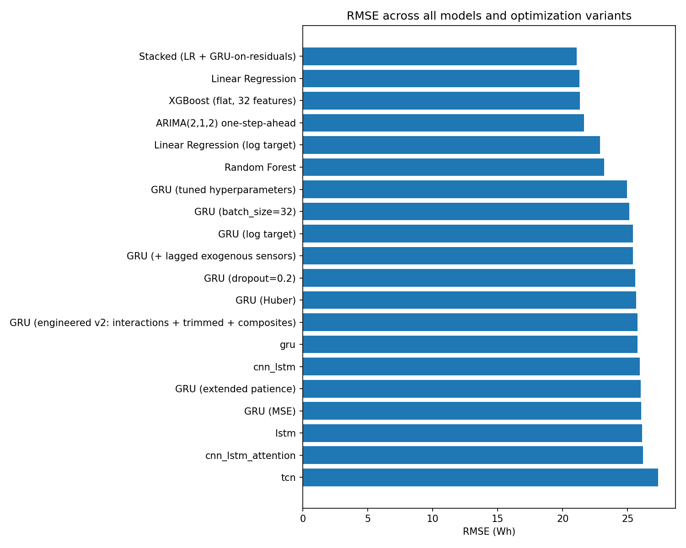{width=90%}

Plotted rather than just tabulated, the same pattern is visible at a
glance: every standalone deep learning variant, regardless of which
hyperparameter got tuned (window, hidden size, layers, learning rate,
batch size, dropout rate, loss function, patience, feature set, target
transform), clusters between RMSE 25 and 27.3. Linear Regression, ARIMA,
XGBoost, Linear Regression on a log target, Random Forest, and the
Stacked model all sit in a distinctly better band between RMSE 21 and
23.2. Nothing tested moved a standalone deep learning model out of the
first cluster and into the second, only combining one with Linear
Regression did.

\newpage

# Model Optimization

## Standard Optimization Techniques

The sequence window length was tuned first where each architecture was swept
across candidate windows (24, 72, 144 steps) with a reduced training
budget, then retrained at its best window with full epochs and patience.
This "sweep then finalize" approach kept the total compute manageable,
and all five architectures landed on 24 steps independently.

A proper hyperparameter search was run on GRU, since it was the
strongest deep model. This was a random search over hidden size (32, 64,
128), number of layers (1, 2), and learning rate (5e-4, 1e-3, 2e-3), with
6 sampled configurations at a reduced budget, followed by a full-budget
retrain of the best one, which turned out to be hidden size 128, 2 layers,
and a learning rate of 2e-3.

For regularization spatial dropout was used at a rate of 0.2 across every
recurrent and convolutional model, for the reasons covered in Model
Design. For early stopping patience-based stopping was used with the best
weights restored, and it was also tested as an extended-patience variant (patience
of 20 over 100 epochs, compared to the default patience of 10 over 60
epochs) explicitly, to check whether the models were simply cut off too
early.

Batch size and dropout rate were tested separately too, since the brief
lists batch size alongside learning rate/layers/neurons under
hyperparameter tuning, and dropout rate under regularization, and neither
had been touched by the search above. A sweep across batch sizes {32, 64,
128, 256} on the default GRU found 32 as the best; finalized at full
budget it reached RMSE 25.12, about 2.5% better than the batch_size=64
default, a similar-sized effect to the hidden-size/layers/lr search. A
separate sweep across dropout rates {0.1, 0.2, 0.3, 0.4, 0.5}, also on the
default GRU, found that 0.2, the rate already locked in during Model
Design, was the best of the five tested, so nothing needed to change
there, the original choice held up under testing rather than being an
unexamined default.

## Investigating Why Deep Learning Underperforms

Rather than treating Linear Regression's win as something to gloss over,
a series of independent tests were run to figure out whether that gap could
still be closed, or whether it reflects something real about the data.

The first test was a raw-features-only ablation. All 11 of the
`Appliances`-derived lag and rolling features were dropped, keeping only the other 21,
and retrained GRU. Its R2 collapsed from 0.551 to -0.09, which is worse
than just predicting the mean every time. That's a strong signal that
almost all of the usable signal in this dataset is autoregressive.

Next ARIMA(2,1,2) was tested, using only the target's own history and no
features at all. It reached an RMSE of 21.64 and R2 of 0.686, tying Linear
Regression almost exactly. That told that the ceiling isn't specific to deep
learning or to multivariate modeling generally, since a classical
univariate model with none of the engineering effort gets to the same
place.

XGBoost was also tested on the same 32 features, since it's non-linear but
not sequential. It reached RMSE 21.32 and R2 0.696, again tying Linear
Regression. This suggests the non-linear interactions XGBoost can capture
don't add much once `Appliances_lag1` is available as an input.

Alongside this a VIF (variance inflation factor) analysis was run, since the
pairwise correlation filter in feature selection can miss group-level
multicollinearity. It found several features with severe collinearity,
`Tdewpoint` at 186, `indoor_outdoor_delta` at 79, `heat_index_proxy` at 74,
and `RH_out` at 69. This matters for how reliable Linear Regression's
individual coefficients are to interpret, but it doesn't explain the
accuracy gap, since these are exactly the weak-signal environmental
features the ablation test already showed contribute very little.

The hyperparameter search mentioned above gave GRU a real, if modest,
improvement, where RMSE went from 25.77 down to 24.96, about a 3% reduction.
So model capacity was a minor factor, just not the main one.

Then an updated feature set (interaction terms between the lag-1
feature and time of day, a trimmed lag set, and composite indoor
temperature/humidity features) was tested, and it left RMSE basically unchanged at
25.77. A log-transform of the target had a mixed effect where it made Linear
Regression noticeably worse (RMSE went from 21.30 to 22.89) while helping
GRU slightly (25.77 down to 25.39). And adding lagged versions of the
outdoor temperature and humidity sensors, to test for a delayed
thermal-inertia effect, brought GRU's RMSE down slightly to 25.42, about a
1.3% improvement.

The one experiment that actually changed the outcome was stacking. The architecture took
Linear Regression's predictions, computed its residuals on the training
set, and trained a GRU specifically to predict those residuals rather than
the raw target. Combining the two predictions at test time brought RMSE
down from 21.30 to 21.06 and R2 up from 0.696 to 0.700, actually beating
Linear Regression outright.

Here's the summary of all nine tests:

| # | Experiment | Result | What it tells |
|---|---|---|---|
| 1 | Raw-features-only ablation | GRU R2 drops from 0.551 to -0.09 | Nearly all the signal is autoregressive |
| 2 | ARIMA(2,1,2), target history only | RMSE 21.64, R2 0.686, ties Linear Regression | The ceiling isn't specific to deep learning |
| 3 | XGBoost, same 32 features | RMSE 21.32, R2 0.696, ties Linear Regression | Non-linear interactions don't add much once lag-1 is available |
| 4 | VIF analysis | Several features show severe multicollinearity | Affects interpretability, not accuracy |
| 5 | GRU hyperparameter search | RMSE 25.77 to 24.96, about 3% better | Capacity was a small factor, not the main one |
| 6 | Engineered feature set v2 | RMSE unchanged | Not a missing-combination problem |
| 7 | Log-transformed target | Hurts Linear Regression, helps GRU slightly | Huber loss was already the better fix |
| 8 | Lagged exogenous sensors | RMSE 25.77 to 25.42, about 1.3% better | Small and real, but not a gap-closer |
| 9 | Stacking (Linear Regression plus GRU on residuals) | RMSE 21.30 to 21.06, beats Linear Regression | The one approach that actually wins |

Four different methods (the ablation test, ARIMA, XGBoost, and the shared
ceiling across all five deep learning architectures) point to the same
conclusion from different angles: `Appliances` consumption at 10-minute
resolution behaves close to a pure autoregressive process. No amount of
extra feature engineering, added model capacity, or target transformation
closed that gap for a standalone deep learning model. The one thing that
did move the needle was combining Linear Regression with a GRU trained on
its leftover errors, which tells me the right answer here is a hybrid
model rather than a bigger single architecture.

\newpage

# Challenges and Solutions

Avoiding data leakage turned out to need several separate safeguards, not
just one. Rolling and lag features are computed on the target after
shifting it by one step, so a feature at row t never sees the value being
predicted at that same row. Both scalers are fit only on the training
split. And the train/test split itself is chronological rather than
random. Each of these were explicitly checked rather than assuming they were
handled correctly by default.

The target's skew of 3.39 shaped a lot of downstream decisions.
Huber loss was chosen over MSE specifically because of it, and later tested that
choice against an explicit log-transform of the target. The log-transform
actually hurt Linear Regression, since it distorts the otherwise close to
linear relationship between `Appliances_lag1` and the raw target, while
only marginally helping GRU. That confirmed Huber loss was the better fix,
at least for the linear model.

Feature selection needed more than one method to trust. Random Forest
importance ranked `Press_mm_hg` suspiciously high, and permutation
importance, which measures actual held-out performance impact rather than
tree-impurity reduction, showed that ranking was an artifact and dropped
it. If it was stopped after the Random Forest stage, a non-predictive feature
would have made it into the final set.

Deep learning not beating the baseline could have easily been written off
as a failure, but methods were tried to treat it as something worth investigating
properly instead. The nine tests in Model Optimization exist specifically
to tell apart "the models are undertrained, undersized, or missing
features" from "the ceiling is real," and the combination of the ablation
test with the ARIMA and XGBoost comparisons gives fairly strong, converging
evidence for the second explanation.

A less expected problem came up when adding the XGBoost comparison model.
It crashed the notebook kernel outright. PyTorch and XGBoost each bundle
their own copy of the OpenMP threading runtime, and loading both into the
same process crashes once PyTorch has already done real training work.
Setting `n_jobs=1` on XGBoost's regressor reduced the problem but didn't
fully fix it. The actual fix was to run XGBoost in a completely separate
subprocess (`src/run_xgboost_subprocess.py`) that never imports `torch`
at all, reading its result back as JSON. Keeping the two libraries in
separate processes avoided the conflict entirely instead of trying to make
them coexist in one.

That crash also highlighted something worth remembering about notebooks in
general. When a kernel dies, everything in memory goes with it, not just
whatever the current cell was doing. A `.ipynb` file only saves the code
and the last output of each cell, not the live variables sitting in the
kernel's memory while it runs. So there's no way to "resume" a crashed
notebook partway through. The only reliable fix was a full, clean rerun of
the whole notebook from the top.

\newpage

# Conclusion

The best model overall is the stacked hybrid, Linear Regression plus a GRU
trained on its residuals, with MAE 13.45, RMSE 21.06, MAPE 17.18%, and R2
0.700. It's the only model tested, that actually beats plain Linear
Regression, and by extension the strongest result to come out of this
project.

The key finding is that `Appliances` consumption at 10-minute resolution
behaves close to a pure autoregressive process. This must not be claimed
from a single result, so it was checked four separate ways. A raw-features
ablation that collapses to an R2 of -0.09 without the target's own lag and
rolling history, a univariate ARIMA model with no feature engineering at
all that ties Linear Regression, a non-sequential gradient-boosted model
(XGBoost) on the same features that also ties Linear Regression, and a
shared performance ceiling across all five deep learning architectures
that neither more capacity, better features, nor a target transformation
meaningfully closes.

But it cannot be concluded that the deep learning side of the project failed.
The training curves show healthy convergence with no overfitting,
five distinct architectures were tested, and a genuine hyperparameter search
was run rather than just tweaking numbers by hand. It's more a property of this
specific dataset at this specific resolution. With a dominant AR(1) signal
and fairly weak correlation from the environmental sensors, a closed-form
linear fit on `Appliances_lag1` is hard to beat by learning the same
relationship through gradient descent on around 13,300 training rows. The
one thing that did beat Linear Regression combined it with a deep model
instead of replacing it, which tells that there's a small amount of
exploitable non-linear structure in this data, just not enough on its own
to justify a standalone deep architecture.

A few things that should be tried if kept working on this:

More data would help. 137 days gives around 13,300 effective training rows
once you account for the feature-engineering drop and windowing, which is
a modest sample for a deep sequence model. A longer collection period
might let the extra capacity of the deep models actually pay off.

An attempt was made on seasonal ARIMA/SARIMAX model at the daily period (144 steps)
but found it too slow to run at this dataset's scale within the time had.
It would be worth revisiting with a faster implementation.

The stacked model here uses a single GRU on Linear Regression's residuals.
A small ensemble of residual models, maybe averaging a GRU and an XGBoost
residual corrector, might squeeze out a bit more of the remaining
non-linear signal.

It would be also better to properly test the holiday and special-event features the
brief suggests, using a verified calendar for the house's location and
dates, rather than leaving them out for lack of a reliable source.

And if per-appliance or sub-metered data were available, it might reveal
structure that the aggregate `Appliances` reading hides completely.

\newpage

# References

1. Candanedo, L. M., Feldheim, V., and Deramaix, D. (2017). Data driven
   prediction models of energy use of appliances in a low-energy house.
   Energy and Buildings, 140, 81-97. This is the original paper behind the
   UCI Appliance Energy Prediction dataset used in this assessment.
2. TensorFlow: Time Series Forecasting with LSTM Neural Networks (the
   tutorial referenced in the assessment brief).
3. Kaggle: Time Series Feature Engineering (the guide referenced in the
   assessment brief).
4. Chollet, F. Deep Learning with Python (referenced in the assessment
   brief as a general architecture and training reference).
5. PyTorch's official documentation and tutorials, for the `torch.nn`
   layer reference, the `DataLoader`/`Dataset` API, `nn.HuberLoss`, and
   `CosineAnnealingLR`.
6. Scikit-learn's documentation for `LinearRegression`,
   `RandomForestRegressor`, `StandardScaler`, `MinMaxScaler`, and
   `permutation_importance`.
7. Statsmodels documentation for `STL`, `ARIMA`, and
   `variance_inflation_factor`.
8. Bai, S., Kolter, J. Z., and Koltun, V. (2018). An Empirical Evaluation
   of Generic Convolutional and Recurrent Networks for Sequence Modeling.
   This is the paper behind the Temporal Convolutional Network
   architecture implemented in `src/model.py`.

---

*AI tools declaration: I used Claude (Anthropic) during this assessment for
architecture planning, code structure and docstring guidance, debugging
(including tracking down the PyTorch/XGBoost crash described in Challenges
and Solutions), and running the optimization experiments in
`notebooks/05_Optimization_Evaluation.ipynb`. I reviewed and understood
every implementation, analysis, and final decision myself with proper justifications.*
